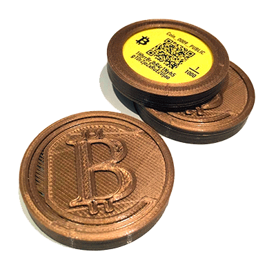
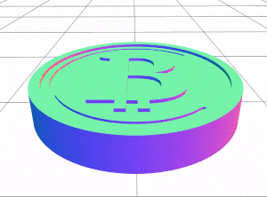
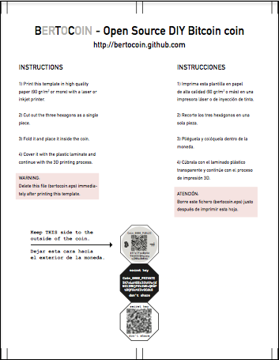
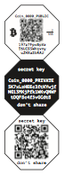
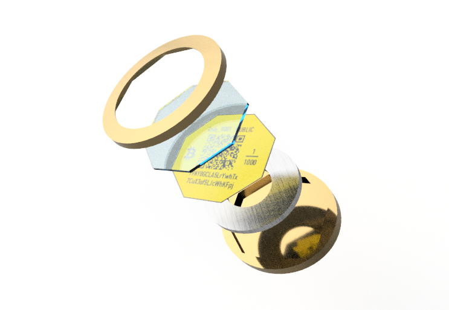

# Bertocoin - Tu propia moneda Bitcoin 3D
Fabrica tu propia moneda Bitcoin con una impresora 3D doméstica.
<p align="left">
  
</p>

## Introducción
Este repositorio contiene instrucciones, software y modelos CAD diseñados para permitir a un usuario crear sus propias monedas físicas Bitcoin.

## Definición
Una moneda Bitcoin es un dispositivo tangible, con aspecto de moneda, que permite a su poseedor almacenar una cantidad determinada de bitcoins.

## Historia
Las primeras monedas físicas fueron creadas por Mike Caldwell, bajo el nombre comercial de ["Casacius coins"](https://en.bitcoin.it/wiki/Casascius_physical_bitcoins). Tras un moderado éxito inicial, dejaron de fabricarse en 2013, después de recibir amenazas legales dado que, según el Departamento del Tesoro de EEUU, dichas monedas constituyen un modo de "transmisión de dinero" lo que requiere, según la ley estadounidense, la obtención de licencias específicas. Por este motivo, el creador decidió retirarlas del mercado al considerar que no era rentable la obtención de dichas licencias.

Posteriormente han aparecido otras ofertas comerciales, la mayoría de las cuales han ido desapareciendo por diversos motivos.

En consecuencia, en la actualidad no es fácil adquirir una moneda Bitcoin de un proveedor comercial, por lo que surge este proyecto para facilitar la producción de tales monedas al usuario final.

## Requisitos
Para fabricar tu moneda necesitarás:

### Software

Este repositorio alberga la herramienta software que te permitirá crear la moneda.
Existen dos alternativas para ejecutar el código:

- Ejecutar python dentro de [Docker](#ejecución-con-docker).

- Ejecutar en local Python 3.11 con la ayuda de [Poetry](#instalación-de-dependencias-con-poetry).

En la sección [*Instalación y uso del software*](#instalación-y-uso-del-software) encontrarás instrucciones detalladas de cómo configurar y utilizar la herramienta.

### Hardware
1. Impresora 3D de filamento. 
Se utiliza para imprimir la carcasa de la moneda. 
Para este proyecto se utilizó una Anet A8, pero cualquier impresora Prusa o similar es perfectamente válida.

    Notas: 
   - Debido al proceso de colocación de insertos dentro de la moneda, NO se pueden utilizar impresoras de resina.
   - Se recomienda utilizar plástico PLA.
   - El diseño está optimizado para un cabezal extrusor de 0.4 mm.

2. Impresora Láser/Inyección de tinta.
Se puede utilizar cualquier impresora láser de calidad doméstica. Se recomienda utilizar tinta/tóner original y consultar la duración de la impresión en las características técnicas de durabilidad del fabricante.

3. Papel A4.
Se recomienda utilizar papel blanco o amarillo de oficina con un gramaje de 90 gr/m2 ó superior.

4. Arandela.
El diseño prevé la inserción de una arandela metálica para darle total opacidad a la clave secreta guardada en el interior.
La arandela recomendada tiene un diámetro exterior de 30 mm y un grosor de 2 mm.

5. Lámina de metacritalo transparente de 1 mm de espesor.

## Instalación y uso del software

### Ejecución con Docker
La forma más sencilla de ejecutar esta herramienta es creando un container con [Docker](https://www.docker.com/). De esta forma no tenemos que preocuparnos de tener todas las dependencias correctamente instaladas ni la versión de Python actualizada en nuestro sistema.

Una vez instalado Docker, solo tenemos que:

1. Clonar este repositorio.

2. Crear el contenedor:
  ```shell
    $ docker build . -t bertocoin
  ```

3. Ejecutarlo **montando** el directorio del repositorio en el directorio `docker_app` del contenedor:
  ```shell
    $ docker run --rm -v $(pwd):/docker_app bertocoin --help
  ```

### Instalación de dependencias con Poetry
Otra alternativa a Docker es instalar en nuestro sistema las dependencias del proyecto y ejecutarlo con [Poetry](https://python-poetry.org/).

Para ello debemos previamente tener instalada la version 3.11 de Python, que utilizaremos posteriormente para instalar Poetry en su versión 1.3.1

Cuando tengamos nuestro entorno configurado, deberemos instalar todas las dependencias con:

```shell
$ poetry install
```

Tras toda esta instalación, por fin podemos ejecutar la herramienta con el comando:
```shell
$ poetry run python3 bertocoin --help
```

> Si el usuario desea prescindir de Poetry, también tiene la alternativa de extraer las dependencias del `pyproject.toml` a un fichero `requirements.txt` para posteriormente instalarlas con *pip3* y ejecutar la herramienta directamente con *python3*.

### Instrucciones de uso
Tras seguir las instrucciones de instalación (Docker o poetry), solo tenemos que ejecutar:

```shell
$ docker run --rm -v $(pwd):/docker_app bertocoin
ó
$ poetry run python3 bertocoin
```

Es posible especificar varias opciones para conseguir un mayor control sobre la generación de los datos de la moneda. 
Para conocer las opciones disponibles, puede ejecutar el comando con el argumento `--help`. 
       
Una vez lanzado el programa, se generará un sub-directorio llamado **delete-me**, donde aparecerá un fichero denominado **print-me.svg**.
Este es un fichero, en formato Scalable Vector Graphics, que contiene una hoja con las instrucciones y la carátula que debemos imprimir y colocar dentro de la moneda 3D.


> :warning: **ATENCIÓN**
>
> El usuario dispone de 3 minutos para imprimir este fichero.
> Después, el directorio **delete-me** y todo su contenido se borrará automáticamente, ya que contiene
> la clave privada con la que se podría acceder a los fondos de la moneda.
> Si por alguna razón, el borrado automático no funcionase, es **imperativo borrar manualmente** el 
> directorio **delete-me** y todo su contenido.
> De no hacerlo así es PRÁCTICAMENTE SEGURO que pierda sus fondos Bitcoin si algún actor malicisioso
> accede a la información contenida en este directorio.
>
> La clave privada se generará a partir de una semilla de texto generada aleatoriamente por el programa.
> Si desea facilitar su propia semilla, puede utilizar la opción correspondiente.
> Para conocer todas las opciones disponibles, lance el script con la opción -h.
   
## Impresión y colocación de la carátula impresa

<p align="left">
  
</p>
El modelo imprimible de la moneda se encuetra disponible en este repositorio.

El fichero _print-me.svg_ contiene una carátula recortable que se ha de insertar dentro de la moneda 3D .
Aquí podemos ver una imagen de un fichero de ejemplo:

<p align="left">
  
</p>

La carátula tiene la siguiente forma:

<p align="left">
  
</p>

Es preciso imprimir esta hoja y recortar la carátula **antes** de iniciar el proceso de impresión 3D de la moneda.

Una vez impresa y recortada la carátula, se deberá utilizar la lámina transparente de metacrilato y recortar una pieza en forma de hexágono de las mismas dimensiones que la carátula que acabamos de imprimir.

Se deberá pausar la impresión de la moneda 3D aproximadamente a la mitad del proceso.
Entonces, se introducirán, en este orden:

1. La pieza hexagonal de metacrilato.
2. La carátula plegada, siguiendo las instrucciones de la hoja impresa, y dejando visible la cara identificada como "COIN_XXXX_PUBLIC".
3. La arandela metálica, que proporciona opacidad a la clave privada, inserta en la moneda, y fija la carátula para asegurar que se mantiene en su sitio al continuar con el proceso de impresión 3D.

<p align="left">
  
</p>

Una vez colocados los tres insertos, se continuará con la impresión de la moneda 3D.

Para mayor información, descargue y lea atentamente este fichero PDF: "Bertocoin - Manual de Impresión de la Moneda 3D".

## Uso de la moneda

Las instrucciones sobre cómo utilizar la moneda, se encuentran en el siguiente fichero PDF: [Bertocoin - Manual del Usuario](./resources/Bertocoin_Manual_de_usuario.pdf)

