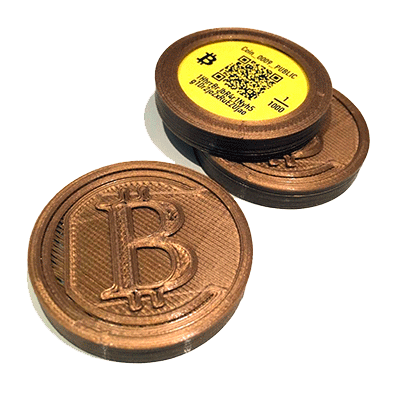

# bertocoin - Su propia moneda Bitcoin 3D
Fabrica tu propia moneda Bitcoin con una impresora 3D doméstica.
<p align="left">
  
</p>

## Introducción
Este repositorio contiene instrucciones, software y modelos CAD diseñados para permitir a un usuario crear sus propias monedas físicas Bitcoin.

## Definición
Una moneda Bitcoin es un dispositivo tangible, con aspecto de moneda, que permite a su poseedor almacenar una cantidad determinada de bitcoins.

## Historia
Las primeras monedas físicas fueron creadas por Mike Caldwell, bajo el nombre comercial de ["Casacius coins"](https://en.bitcoin.it/wiki/Casascius_physical_bitcoins). Tras un moderado éxito inicial, dejaron de fabricarse en 2013, después de recibir amenazas legales dado que, según el Departamento del Tesoro de EEUU dichas monedas constituyen un modo de "transmisión de dinero" lo que requiere, según la ley estadounidense, la obtención de licencias específicas. Por este motivo, el creador decidió retirarlas del mercado al considerar que no era rentable la obtención de dichas licencias.

Posteriormente han aparecido otras ofertas comerciales, la mayoría de las cuales han ido desapareciendo por diversos motivos.

En consecuencia, en la actualidad no es fácil adquirir una moneda Bitcoin de un proveedor comercial, por lo que surge este proyecto para facilitar la producción de tales monedas al usuario final.

## Requisitos
Para fabricar tu moneda necesitarás:

### Software
1. Intérprete Python 2.7 superior. 
   - Dependencias: 

     **ecdsa** (Utilizado para los cálculos criptográficos)
     **pyqrcode** (Utilizado para la generación de los códigos QR de la moneda)


2. MonedaBitcon.py (en este repositorio). Un script que permite la generación de las claves privada/pública de la moneda, así como los códigos QR correspondientes.
3. Entropy.txt. Un fichero de texto plano que contiene una cadena SECRETA de texto que se utilizará para generar las claves privadas y públicas de las moneda.


> :warning: **ATENCIÓN**
>
> Es vital que el usuario final cambie el texto contenido en Entropy.txt por su propio texto secreto.
> De no hacderlo así es PRÁCTICAMENTE SEGURO que pierda sus fondos Bitcoin.

4. Un programa de diseño gráfico, tal como Adobe Photoshop, Adobe Illustrator, Google Docs, GIMP, etc.

Este programa se usará para componer el documento que contiene las claves y códigos QR.

### Hardware
1. Impresora 3D de filamento. 
Se utiliza para imprimir la carcasa de la moneda. 
Para este proyecto de utilizó una Anet A8, pero cualquier impresora Prusa o similar es perfectamente válida.
Notas: 
   - Debido al proceso de colocación de insertos dentro de la moneda, NO se pueden utilizar impresoras de resina.
   - Se recomienda utilizar plástico PLA.
   - El diseño está optimizado para un cabezal extrusor de 0.4 mm.

2. Impresora Láser/Inyección de tinta.
Se puede utilizar cualquier impresora láser de calidad doméstica. Respecto a las impresoras de inyección de tinta se recomienda utilizar tinta original y consultar la duración de la impresión en las características técnicas de durabilidad del fabricante.
3. Papel A4
Se recomienda utilizar papel blanco o amarillo de oficina con un gramaje de 100 gr/m2.
4. Arandela
El diseño prevé la inserción de una arandela metálica para darle total opacidad a la clave secreta guardada en el interior.
La arandela recomendada tiene un diámetro exterior de 30 mm y un grosor de 2 mm.

## Uso del software

1. En caso de que el ordenador no cuente con un intérprete de Python 2.7, es preciso comenzar por instalarlo.
Para ello, siga las instrucciones del fabricante de su sistema operativo.

    Enlaces de descarga: 
    
    - [Python 2.70](https://www.python.org/downloads/release/python-270/)
    - [Otras versiones](https://www.python.org/downloads/)

2. Si no están instalados previamente, se requiere instalar los paquetes de Python **ecdsa** y **pyqrcode**. 

Para ello, pueden utilizarse los siguientes comandos:

     ```pip2.7 install ecdsa```
     ```pip2.7 install pyqrcode```

3. Descargar el script de este repositorio denominado 'bertocoin.py' y el fichero de entropia 'entropia.txt' y colocar ambos en un mismo directorio.


5. Editar el fichero 'entropia.txt' con un editor de texto plano, tal como Notepad en Windows o TextEdit en OS X y reemplazar el contenido por una cadena SECRETA de caracteres.
Es recomendable que la cadena contenga suficiente entropía como para que sea difícil de adivinar.
Siga las recomendaciones habituales que se recommiendan para generar claves secretas, tales como:
   - Tamaño: 20 posiciones o más
   - Caracteres: Utilice una mezcla de mayúsculas, minúsculas y símbolos especiales
   
5. Desde ese directorio lanzar el siguiente comando:

     ```python2.7 bertocoin.py numserie cantidad```
     
     Donde __numserie__ se reemplazará por el número de serie deseado para la moneda inicial y __cantidad__ se reemplazará por el número de monedas que se desean generar.
     
     Por ejemplo, para generar las monedas 000 a 010 se lanzará el siguiente comando:
     ```python2.7 bertocoin.py 0 10```
       
6. Una vez lanzado el programa, si la ejecución fue correcta, aparecerán en el mismo directorio una serie de ficheros que contienen las imágenes de los códigos QRs de las monedas que han sido generadas.

Por ejemplo, si la ejecución se realiza cuando el contenido del fichero 'entropia.txt' es:

```SECRET_COIN_SEED:[Replace.With.Your.Own.PassPhrase].```
y lanzando el siguiente comando:

```python2.7 bertocoin.py 0 3```
se generarán en el directorio de trabajo los siguientes archivos de imágenes en formato PNG:

```
     Coin_0000_PRIVATE_5HrRfEb1p6yNdwTP16KzbGVfxxoQNWdP4QjPdfd4nvE8HdBNEf2.png
     Coin_0000_PUBLIC_1AZXC44ZCpBmkHazPyRK84hkiQT7VePk5h.png
     Coin_0001_PRIVATE_5JXgki5kC45TsAwouQ3Z8b7xPZHGyJSVkJuTvDWVWoEceTRhe1u.png
     Coin_0001_PUBLIC_1HVhwf9FjE8LEmiMpzrBFHeJGgGU6nx73Z.png
     Coin_0002_PRIVATE_5K642EAjm4v89gQ3KUGQCwVnJcp54GYFcdcmE7xaAb2T1QFTxse.png
     Coin_0002_PUBLIC_1KUaptkkyRUq6tKo5Ace5UJrWHhakeWRox.png
     Coin_0003_PRIVATE_5JrRwCmRcevwGhsWsPYbkJcwkFe6utfEJaQ5NsZHeEoynFBFvmT.png
     Coin_0003_PUBLIC_18AERACD8AVzJsweEZrvYDKR4e8eekfBhY.png
```


> :warning: **ATENCIÓN**
>
> Es vital que el usuario final cambie el texto contenido en Entropy.txt por su propio texto secreto.
> De no hacderlo así es PRÁCTICAMENTE SEGURO que pierda sus fondos Bitcoin.
> Este ejemplo solamente se ofrece para que el usuario verifique el funcionamiento del software.
> En **NINGUN CASO** se deben generar las monedas reales utilizando este valor de ejemplo.


